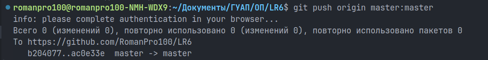

# Лабораторная работа №6, "Github"

## 1 Цель работы
Цель лабораторной работы: изучение базовых возможностей системы управления версиями, опыт работы с Git Api, опыт работы с локальным и удаленным репозиторием.

## 2 Ход работы
Работа проводилась на ОС Linux Mint 22, в котором по умолчанию установлен Git, с использованием редактора VS Code.

### 2.1 Настройка клиента
На момент начала работы аккаунт на Github [уже существовал](https://github.com/RomanPro100), но необходимо было настроить локальный клиент Git. Глобальные настройки Git в Linux хранятся в файле `~/.gitconfig`, его можно отредактировать в любом текстовом редакторе, либо командой `git config --global --edit`.


Вывести отдельные настройки можно командой `git config --global <название_настройки>`, а изменить — командой `git config --global <название_настройки> <новое_значение>`.


### 2.2 Клонирование репозитория
После этого в интерфейсе Github был создан форк [репозитория](https://github.com/Kurtyanik/LR6) с копированием всех веток. 


Этот форк был клонирован на устройство командой `git clone`. После клонирования репозиторий был открыт для дальнейшей работы в редакторе VS Code командой `code LR6`.


### 2.3 Создание и подтягивание файла
В интерфейсе Github в ветку `master` был добавлен текстовый файл `a.txt`.


После этого в локальном репозитории были получены изменения в удалённом репозитории при помощи команды `git pull`.


После этого в проводнике VS Code появился подтянутый файл.


### 2.4 Просмотр истории изменений

Просмотреть историю коммитов во всех ветках можно в виде ASCII-графа при помощи команды `git log --all --graph`.


Также в VS Code есть вкладка Source Control, в которой можно просматривать историю коммитов в разных ветках, изменения файлов, добавлять файлы в индекс.


### 2.5 Устранение конфликта слияния

Когда при слиянии возникает конфликт, в VS Code конфликтующие файлы отмечены прямо в проводнике восклицательным знаком, и если их открыть, можно увидеть конфликтующие строки.  


Сверху перечислены опции, как решить конфликт. В данном случае был выбран вариант `Accept Current Change`, т.е. оставить файл таким, какой он есть в ветке `master`, и проигнорировать изменения в ветке `branch1`.

После этого необходимо было добавить файл в индекс и сделать коммит: ветки автоматически слились, и таким образом конфликт слияния был решён.


Изменения видны и во вкладке Source Control в VS Code: можно увидеть, как две ветки слились в одном коммите.


### 2.6 Удаление ветки

Далее ветку `branch1` было необходимо удалить как из локального, так и из удалённого репозитория. Сначала было запушено удаление ветки из удалённого репозитория командой `git push origin --delete branch1`. После этой команды ветка была удалена с Github, но изменения в ветке `master` запушить не удалось, поэтому была выполнена команда `git push origin master`.


После этого была удалена ветка в локальном репозитории командой `git branch -D branch1` (на скриншот она не попала).

### 2.7 Коммиты

Далее были сделаны три коммита, последний из которых отменяет предпоследний.


Сначала содержимое файла `a.txt` было заменено на:
```
abcdefg

```
Изменения были добавлены в индекс командой `git add` и зафиксированы командой `git commit`.

Затем файл был изменён ещё раз:
```
abcdefg
hijklmnop
```

После этого командой `git revert` этот коммит был отменён, а именно, эта команда создаёт новый коммит, который возвращает файл в то состояние, которое было до коммита, который она отменяет.

### 2.8 Написание отчёта

Ветка `otchet` для отчёта была создана командой `git branch`. Чтобы переключиться на редактирование новой ветки, была использована команда `git switch`.


Для написания отчёта был использован всё тот же редактор VS Code со встроенными превью и подсветкой синтаксиса Markdown.


После написания различных частей отчёта делались коммиты. Файлы добавлялись в индекс либо командой `git add`, либо в интерфейсе VS Code, затем изменения фиксировались командой `git commit` с комментарием.

Пример:
```bash
git add README.md
git commit -m "Добавил структуру, заполнил цель"
```

Периодически изменения отправлялись в удалённый репозиторий командой `git push`. При первой отправке в нём не было ветки `otchet`, поэтому в первую команду `git push` добавлен флаг `-u`, который создаёт ветку для пуша изменений и связывает её с локальной.


Также для полноты картины были запушены коммиты в ветке `master`.



## 3 Лог команд
```bash
git config --global --edit

git clone https://github.com/RomanPro100/LR6
code LR6
git pull
git log --all --graph

git add mergefile.txt
git commit -m "Решил конфликт слияния"

git push origin master --delete branch1
git push origin master
git branch -D branch1

git add a.txt
git commit -m "Добавил больше букв"
git add a.txt
git commit -m "Добавил ещё букв"
git revert HEAD

git branch otchet
git switch otchet

git add <имя_файла1> <имя_файла2> <имя_файла3>
git commit -m "<комментарий>"
git push -u origin otchet
git push

git push origin master:master

git log --pretty=format:"(%as) %an: [%h] %s
```
## 4 История операций
Для получения и форматирования истории действий использована команда `git log` с параметром `--pretty`.
```bash
$ git log --pretty=format:"(%as) %an: [%h] %s"
(2024-11-24) Прокопов Роман Игоревич, 4314: [99589fe] Ход работы дописан
(2024-11-24) Прокопов Роман Игоревич, 4314: [9d27339] Забыл в прошлый коммит добавить README
(2024-11-24) Прокопов Роман Игоревич, 4314: [528dac5] Больше наполнения
(2024-11-24) Прокопов Роман Игоревич, 4314: [46baa67] Переименовал Скриншоты в Историю операций
(2024-11-24) Прокопов Роман Игоревич, 4314: [4d5e1a3] Начал заполнять Ход работы, добавил скрины
(2024-11-24) Прокопов Роман Игоревич, 4314: [3cac10c] Исправил лог
(2024-11-24) Прокопов Роман Игоревич, 4314: [5ca0c91] Добавил лог и забытую точку
(2024-11-24) Прокопов Роман Игоревич, 4314: [a91d2b0] Добавил структуру, заполнил цель
(2024-11-23) Прокопов Роман Игоревич, 4314: [ac0e33e] Revert "Добавил ещё букв"
(2024-11-23) Прокопов Роман Игоревич, 4314: [271eee4] Добавил ещё букв
(2024-11-23) Прокопов Роман Игоревич, 4314: [bd77528] Добавил больше букв
(2024-11-23) Прокопов Роман Игоревич, 4314: [b204077] Решил конфликт слияния
(2024-11-23) RomanPro100: [62ebbc5] Create a.txt
(2020-11-21) Kurtyanik: [921f53b] Обновление информации
(2020-11-21) Kurtyanik: [0f9f50d] Заполнил файл
(2020-11-21) Kurtyanik: [c08a654] Файл создан пустым
(2020-11-21) Kurtyanik: [3c6e913] Initial commit
```
## 5 Выводы
Были освоены приёмы работы с Git-репозиториями и хостингом Github, изучены создание коммитов, работа с ветками, решение конфликтов слияния, расмотрены способы визуализации истории коммитов. Можно смело сказать, что Git — чрезвычайно полезный инструмент в разработке и что его мало что может заменить.